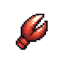

# ClawLess

<p align="center">
	
</p>

<p align="center">
	<a href="./README.md">中文: README</a>
</p>

ClawLess is a free AI agent deployed on Vercel — a lightweight alternative to OpenClaw and Manus.

> **It's simple, free, open-source, and easy to deploy to Vercel.**

You don't need a Mac Mini, a VPS, or any dedicated hosting — all you need is **a free Vercel account** and **an AI API key**.

ClawLess provides the core features you'd expect from OpenClaw: Chat, Skills, Memory (with RAG search), Channels, Bash tools (running in the sandbox), and Cron jobs. It also includes features inspired by Manus, such as Files, MCP, and Sub-Agents.

We consider ClawLess a lightweight agent. It's not the best place to run complex workloads, but it's free, easy to deploy, and can connect to your IM platforms.

We recommend using lightweight or free models to try ClawLess — for example, `stepfun-3.5-flash` is a great choice.

## Deploy

You don't need to download the project locally or own a VPS. You only need:

- A Vercel account (the free tier is sufficient)
- An API key compatible with OpenAI/Anthropic/Gemini (if you don't have one, you can get one for free from OpenRouter)
- Click the deploy button to deploy to Vercel

If you plan to spend on Vercel or OpenRouter, we recommend setting a spending limit.

If you want to update, simply sync your fork with the upstream repository; this will trigger Vercel to redeploy your site.

## Quick Start

During deployment, you must add the following environment variables: `AUTH_SECRET` (for encryption), and `USERNAME` and `PASSWORD` (for login). These three environment variables are important—do not expose them.

After deployment you should have a public link. Bookmark that link, open it in your browser, log in with your username and password, and go to the "Config" page to configure the agent.

In Config, add a Provider with your own API key. In most cases this will be an "OpenAI Compatible" provider.

After adding your API key, set the `Default Model` and `Embedding Model` which will be used for chat and memory.

After configuring these settings, your agent should be able to chat via the web UI. Try clicking the first card in "Chat" to configure and customize your agent.

If you want to connect to your IM, go to the "Channel" section to configure IM-related settings and set up a whitelist. After configuring, connect your IM webhook to ClawLess.

ClawLess can use Vercel Sandbox to execute commands, but the sandbox is not permanent. Free Vercel accounts have limited sandbox time, so ClawLess is not suitable for long-running or complex tasks.

By default we do not enable browsing/search/weather features. If you need them, add the appropriate MCP.

## Development

Running this project locally or on your own VPS is not supported — ClawLess is designed as a lightweight alternative running on Vercel. If you want to develop or test the project, fork and deploy it on Vercel, then pull the environment and run locally.

```bash
cd your-clawless

bun install

# Pull Vercel environment variables to local, including AUTH_SECRET, USERNAME, PASSWORD, and keys for KV, DB, Blob and Sandbox.
bun vercel pull

bun dev
```

If you encounter database schema errors, try running the `postbuild` script to apply database migrations.

The project uses Next.js and relies on Upstash (Redis KV) and Neon (Postgres with the `Vector` extension) for data storage. File storage uses Vercel Blob and code execution uses Vercel Sandbox. Agents are built with Vercel Workflow and the Vercel AI SDK. IM integration is done via webhooks and the Vercel Chat SDK.

## Others

I'm currently looking for work — feel free to contact me if you're interested.

If you have ideas or find issues, please open a Pull Request or create an Issue. Contributions are welcome.

Some people call this a toy project — you can think of it that way, and proudly use Codex and Copilot for "vibe coding".

Thanks to OpenClaw and Manus for inspiration, to Vercel as the deployment platform, and to all the open source projects used here — and thank you.

This project is licensed under the MIT License.
